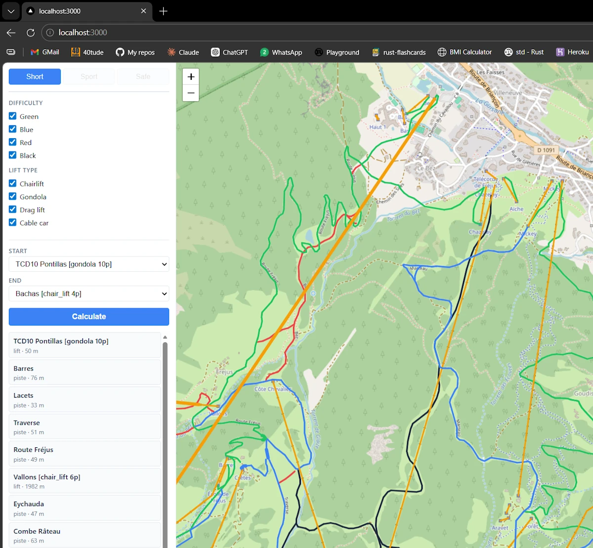

# piste_che

> **Warning:** The `.cargo/` folder contains Windows-specific configuration (custom `target-dir` for OneDrive, CPU flags). Delete or rename before building:
> ```powershell
> Rename-Item .cargo .cargo.bak
> ```
> More information on this [page](https://www.40tude.fr/docs/06_programmation/rust/005_my_rust_setup_win11/my_rust_setup_win11.html#onedrive).


## Description

Ski itinerary planner for the Serre Chevalier ski area (French Alps). Full-stack Rust: SSR server (Axum) + WASM client (Leptos hydration). Built with Claude Code and Spec Kit.

<figure style="text-align: center;">

<figcaption>...</figcaption>
</figure>

A live version is available on [Heroku](https://piste-che-524529397e99.herokuapp.com/). Free tier -- may be slow to start.


## Features

- Interactive Leaflet map with all pistes and lifts
- Difficulty and lift-type filter panel
- Dijkstra shortest-route between any two lifts (Short mode)
- Step-by-step itinerary panel with distances
- Segment popup: click any piste or lift for name, kind, length, and altitude
- Mobile-responsive layout with slide-up sidebar


## Architecture

| Layer | Technology |
|---|---|
| UI framework | Leptos 0.7 (SSR + WASM hydration) |
| Web server | Axum 0.7 + Tokio (single-thread) |
| Map | leptos-leaflet 0.9 (Leaflet.js wrapper) |
| Serialization | serde + serde_json |
| Allocator | mimalloc |
| Build | cargo-leptos 0.3.x |

Key design points:
- `src/models.rs` -- 8 shared DTOs compiled for both server and WASM; zero duplication
- `src/routing/` -- SSR-only: OSM data load, 7-step `build_graph()`, Dijkstra
- `src/server/api.rs` -- `GET /api/get_area` (Axum) + `POST /api/compute_route` (Leptos server fn)
- Data auto-selected at startup via `find_latest_json("data/")` (most recent timestamped JSON)
- `ssr` and `hydrate` feature flags gate routing/server code out of the WASM bundle

See `ARCHITECTURE.md` for full design details, graph pipeline, and Leptos/WASM gotchas.


## Prerequisites

- Rust stable 1.85+ (edition 2024)
- Perl (required to compile `leptos`): `winget install StrawberryPerl.StrawberryPerl`
- cargo-leptos: `cargo install cargo-leptos`
- WASM target: `rustup target add wasm32-unknown-unknown`


## Build

```powershell
# One-time build (outputs server binary + site/ bundle)
cargo leptos build

# Release build
cargo leptos build --release
```


## Run

```powershell
# Watch mode with hot-reload (default port 3000)
cargo leptos watch

# Custom port
$env:PORT='3000'; cargo leptos watch
```

Then open `http://localhost:3000`.


## Test

### Unit tests (no server required)

```powershell
cargo test --lib
```

63 unit tests covering the routing pipeline (`graph`, `chains`, `dijkstra`, `data`) and UI geometry helpers (`segment_popup`, `map`).

### Integration tests (server must be running)

```powershell
# Terminal 1
cargo leptos watch

# Terminal 2
cargo test --test integration
```

7 integration tests covering API shape, routing modes, filter behavior, and coordinate structure.

### All tests

```powershell
# With server running in another terminal:
cargo test
```


## Deploy Heroku

Heroku does NOT run `cargo leptos build`. The `site/` folder must be created, committed and pushed.

```powershell
# Fill the `site/` folder
cargo leptos build --release

# Commit
git add site/
git commit -m "deploy: rebuild assets"

# Push -- buildpack recompiles server binary for Linux; WASM bundle comes from site/
git push heroku main
```

`cargo leptos build --release` generates:

```txt
site/pkg/
  piste_che.js           <- generated by wasm-bindgen, references piste_che_bg.wasm
  piste_che.wasm         <- cargo-leptos renames piste_che_bg.wasm to piste_che.wasm
  piste_che_bg.wasm.d.ts
  piste_che.css
  piste_che.d.ts
```


### Developing and testing on Heroku

1. **Development on the branch**

```powershell
git checkout -b feature-xyz
# ... code, commits ...
```

2. **Local build + test**

```powershell
cargo leptos build --release
# test locally
```

3. **Deploy to Heroku for testing**

```powershell
cargo leptos build --release
git add site/
git commit -m "deploy: rebuild assets"
git push heroku feature-xyz:main       # <-----THIS ONE IS IMPORTANT local:remote
```

4. **Verification on Heroku**
* Test on the live server
* If there is a bug: fix it on the branch, then redo step 3

5. **Merge into main (once satisfied)**

```powershell
git checkout main
git merge feature-xyz
git push origin main          # GitHub/remote
git push heroku main          # re-deploy from clean main
```

6. **Cleanup**

```powershell
git branch -d feature-xyz
```


**Known cargo-leptos 0.3.x quirk:** the generated JS requests `piste_che_bg.wasm`
but the actual file on disk is `piste_che.wasm`. The server aliases the two names
via a dedicated Axum route (see `src/main.rs`), so no manual rename is needed.

`site-root = "site"` in `Cargo.toml` controls the output directory.
Only `site/` needs to be committed. Heroku's Rust buildpack recompiles the
server binary for Linux. The local Windows binary in `target/` is irrelevant.


## License

MIT License - see [LICENSE](LICENSE) for details


## Contributing

Personal/educational project. External contributions are not actively sought. Constructive feedback on performance, accuracy, or completeness is welcome.
